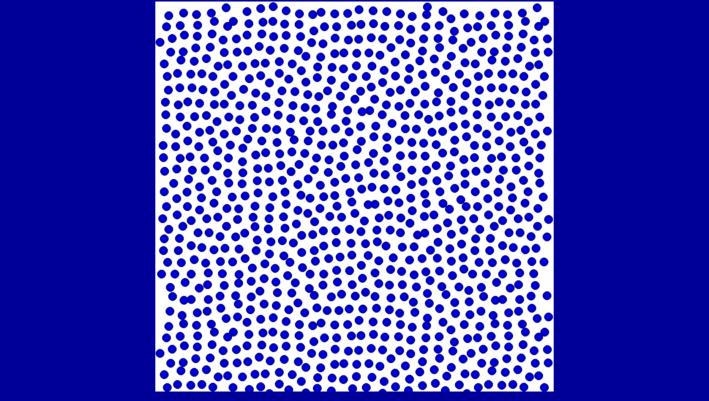

<H2>Introduction</H2>

2D multiphase SPH/SDPD code (authors:
Xiangyu Hu,
Sergey Litvinov,
Oliver Oberinger,
Martin Bernreuther,
Andreas Mattes).

<H2>Build</H2>

<pre>
$ (cd src && make)
$ (cd example && make)
</pre>

<code>make test</code> runs [tests](test/) (requres atest).

<H2>Cases</H2>

Run fluctuating liquid, Couette flow, and elliptic drop:
[cases/thermal.cfg](cases/thermal.cfg),
[cases/couette.cfg](cases/couette.cfg),
[cases/ellipse.cfg](cases/ellipse.cfg).

<H2>Configuration file</H2>

To use the initial condition file

    INITIAL_CONDITION <1/0>

The level of statistics output

    DIAGNOSE 2

number of cells in x and y direction

    CELLS <nx> <ny>

size of one cell

     CELL_SIZE 5.0e-3

support length

     SMOOTHING_LENGTH 5.0e-3

the number of particle in one direction in a cell

     CELL_RATIO	3

the basic of units (used for dimensionless calculations)

     DIMENSION <length> <velcoity> <density> <temperature>

simulation time

     TIMING <inital time> <the last time> <output time interval>

gravity force vector

     GRAVITY <gx> <gy>

Boundary conditions (order is as follow X0, X1, Y0, Y1)
type code
1: periodic
0: wall

    BOUNDARY
    <type codes of boundary <velocity of the wall>
    ...

    NUMBER_OF_MATERIALS <numb_mat>

    MATERIALS
    <material_name> <material_type>	<eta>	<zeta>	<gamma>	<rho0>	<a0>
    (numb_mat lines)

    FORCES
    <mat#k>	<mat#m>		<sigma>	<shear_slip>	<bulk_slip>
    (numb_mat*numb_mat lines, one for each material pair)

`sigma` is a surface tension coefficient

<H2>Initial condition file</H2>

<pre>
    &lt;start time&gt;
    &lt;number of particles&gt;
    ...
    &lt;material name&gt; &lt;X&gt; &lt;Y&gt; &lt;Vx&gt; &lt;Vy&gt; &lt;density&gt; &lt;pressure&gt; &lt;temperature&gt;
    ...
</pre>

[an example](cases/couette.txt)

<H2>Simulations</H2>

Couette flow simulation

<pre>
$ example/sdpd  cases/couette
$ example/sdpd  cases/couette
The left, right, lower and upper boundary 1 1 0 0
0: wall boundary condition
1: perodic boundary condition
2: free slip wall boundary condition
3: symmetry boundary condition
read the propeties of materials and forces
N=10 Time: 0.00868056	dt: 0.000868056
...
</pre>

Water drop in air starting from [an initial condition file](cases/ellipse.cfg)

<pre>
$ example/sdpd cases/ellipse
The left, right, lower and upper boundary 1 1 0 0
0: wall boundary condition
1: perodic boundary condition
2: free slip wall boundary condition
3: symmetry boundary condition
read the propeties of materials and forces
ini.c:787: Read real particles from 'cases/ellipse.txt'
ini.c:798: N = 576
N=10 Time: 0.778993	dt: 0.000868056
...
</pre>

<H2>Output</H2>

Output is in ASCII tecplot files, to convert to punto format run

<pre>
$ scripts/2punto outdata > punto.dat
</pre>

<H2>Visualization</H2>

<pre>
$ punto -D 2 -V -s 50 punto.dat
$ punto -D 2 -c 4 -B 0:0:0.04:0.04 -G -0.2:0.2 punto.dat
</pre>

in gnuplot shell

<pre>
$ plot n=1, 'punto.dat' u 2:3 every :::n::n
$ plot n=10, A=250.0, 'punto.dat' u 2:3 every :::n::n+5, A*x*(L-x)
</pre>

<H2>Images</H2>

Poiseuille flow

Ellipsoid water drop in air

Fluctuating liquid

<H2>References</H2>

- Hu, Xianguy, and Nikolaus A. Adams. "A multi-phase SPH method for
  macroscopic and mesoscopic flows." Journal of Computational Physics
  213.2 (2006): 844-861. https://doi.org/10.1016/j.jcp.2005.09.001

- Litvinov, S., Ellero, M., Hu, X., & Adams, N. A. (2008). Smoothed
  dissipative particle dynamics model for polymer molecules in
  suspension. Physical Review E—Statistical, Nonlinear, and Soft
  Matter Physics, 77(6), 066703.

- Litvinov, S., Ellero, M., Hu, X., & Adams, N. A. (2008). Smoothed
  dissipative particle dynamics model for polymer molecules in
  suspension. Physical Review E—Statistical, Nonlinear, and Soft
  Matter Physics, 77(6), 066703.

- gnuplot http://www.gnuplot.info

- punto http://punto.sourceforge.net

- tecplot http://paulbourke.net/dataformats/tp

- atest https://github.com/slitvinov/atest

- SPH (smoothed-particle hydrodynamics), SDPD (smoothed dissipative
  particle dynamics)
