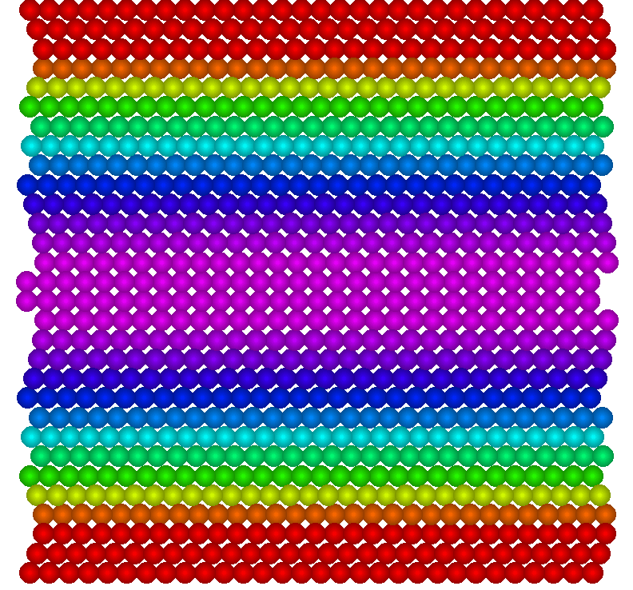
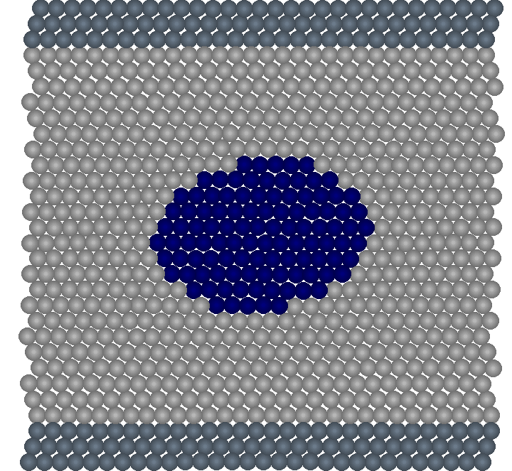

# Introduction

2D multiphase SPH/SDPD code (authors: Xiangyu Hu, Sergey Litvinov,
Martin Bernreuther, Andreas Mattes)

# Build

Run

	scripts/install

or to take advantage of several core/processors

	MAKEFLAGS=-j4 scripts/install

# Test

`make test` runs [tests](test/) (requres atest).

# Configuration file

To use initial condition file

	INITIAL_CONDITION <1/0>

The level of statistics output

	DIAGNOSE 2

number of cells in x and y direction

	CELLS <nx> <ny>

size of one cell

	 CELL_SIZE 5.0e-3

support length

	 SMOOTHING_LENGTH 5.0e-3

the number of particle in one direction in a cell

	 CELL_RATIO	3

the basic of units (used for dimensionless calculations)

	 DIMENSION <length> <velcoity> <density> <temperature>

simulation time

	 TIMING <inital time> <the last time> <output time interval>

gravity force vector

	 G_FORCE <gx> <gy>

Boundary conditons (order is as follow X0, X1, Y0, Y1)
type code
1: periodic
0: wall

	BOUNDARY <use or not wall file>
	<type codes of boundry <velocity of the wall>
	...

	NUMBER_OF_MATERIALS <numb_mat>

	MATERIALS
	<material_name> <material_type>	<eta>	<zeta>	<gamma>	<rho0>	<a0>
	(numb_mat lines)

	FORCES
	<mat#k>	<mat#m>		<sigma>	<shear_slip>	<bulk_slip>
	(numb_mat*numb_mat lines, one for each material pair)

`sigma` is a surface tension coefficient

# Initial condition file

	<start time>
	<number of particles>
	...
	<material name> <X> <Y> <Vx> <Vy> <density> <pressure> <temperature>
	...

[example](cases/couette.rst)

# Simulations

	cd src

Couette flow simulation

	./sph ../cases/couette

Water drop in air starting from [initial condtion file](cases/ellipse.cfg)

	./sph ../cases/ellipse

# Output

Output is in ASCII tecplot files, to convert to punto format run

	cd outdata
	../../scripts/2punto > punto.dat

# Visualization

	punto -D 2 -V -s 50 punto.dat
	punto -D 2 -c 4 -B 0:0:0.04:0.04 -G -0.2:0.2 punto.dat

in gnuplot shell

	plot n=1, 'punto.dat' u 2:3 every :::n::n
	plot n=10, A=250.0, 'punto.dat' u 2:3 every :::n::n+5, A*x*(L-x)

# More

Generate documntation with doxygen

	make doc
	firefox src/html/index.html

Update autotools files

	./bootstrap.sh

# Images

Poiseuille flow

Ellipsoid water drop in air

# References

- Hu, Xianguy, and Nikolaus A. Adams. "A multi-phase SPH method for
  macroscopic and mesoscopic flows." Journal of Computational Physics
  213.2 (2006): 844-861. https://doi.org/10.1016/j.jcp.2005.09.001

- gnuplot http://www.gnuplot.info

- punto http://punto.sourceforge.net

- doxygen https://www.stack.nl/~dimitri/doxygen/

- autotools https://en.wikipedia.org/wiki/GNU_Build_System

- tecplot http://paulbourke.net/dataformats/tp

- atest https://github.com/slitvinov/atest
